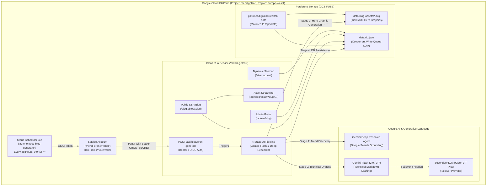

# Autonomous AI Blog Engine & Admin System

> **Architecture, Data Schema, Autonomous Cron Pipeline, Admin Portal, and SEO System for [MehdiGolzari.dev](https://mehdigolzari.dev)**

---

## 1. Feature Overview & Objectives

The **Autonomous AI Blog Engine** is a fully automated, production-ready content and SEO engine designed to publish CTO-level architectural deep-dives tailored to early-stage SaaS and AI startup founders.

- **Persona & Angle:** Practical, high-signal, CTO-level architectural insights grounded in Mehdi Golzari's proprietary **Founder-to-Launch Framework™** and modern software engineering.
- **Autonomous Cadence:** Executes every 48 hours (`0 0 */2 * *`) via **Google Cloud Scheduler** to discover, evaluate, draft, generate vector hero graphics, and publish technical articles.
- **AI Stack & Grounding:**
  - **Research Engine:** Google Gemini Deep Research Agent with Google Search Grounding (`tools: [{ googleSearch: {} }]`).
  - **Content Generator:** Gemini 2.0 / 3.7 Flash with multi-provider failover (Qwen 3.7 Plus).
  - **Hero Asset Engine:** 1200x630px Dark OKLCH Vector Graphics Engine & Imagen 3.
- **Admin Management:** Lightweight, single-route `/admin/blog` portal with HMAC-SHA256 cookie authentication, real-time KPI metrics, manual generation triggers, and a split-screen markdown editor.
- **Storage Strategy:** Flat-file JSON in `data/db.json` with mounted persistent GCS bucket (`gs://mehdigolzari-realtalk-data`) on Google Cloud Run (`/app/data`).

---

## 2. System Architecture

---

## 3. The 4-Stage Autonomous Pipeline

### Stage 1: Deep Trend Research & Topic Scouting
- **Model:** `gemini-3.7-flash` with Google Search Grounding.
- **Task:** Scans live discussions on HackerNews, Substack, Medium, and engineering blogs for high-friction architectural topics (e.g., deterministic state machines for agents, modular monolith extraction, hybrid RAG, PostgreSQL RLS multi-tenancy).
- **Deduplication:** Cross-references candidate topics against the last 30 published slugs in `data/db.json` to guarantee zero topic overlap.

### Stage 2: CTO-Grade Technical Writing & SEO
- **Model:** `gemini-3.7-flash`.
- **Task:** Drafts a complete 1,500+ word article in Mehdi Golzari's voice containing:
  - **Executive Hook:** Real-world friction and cost of premature scaling.
  - **Architecture Diagrams:** Structured ASCII / Mermaid diagrams.
  - **Code Blocks:** Concrete TypeScript, SQL, or Bash snippets.
  - **Comparison Matrix:** Markdown table comparing alternative architectures across Time-to-MVP, Cost, and Complexity.
  - **CTO Action Checklist:** Pragmatic step-by-step guidance.
  - **Contextual Callout:** Natural reference to the free [Go-to-Launch Blueprint™](https://mehdigolzari.dev/blueprint).
  - **Dynamic Reading Time:** Calculated based on generated word count ($\sim 200\text{ words/min}$).

### Stage 3: Branded Dark-Mode Cover Hero Generation
- **Format:** 1200x630px high-resolution vector SVG.
- **Aesthetics:** Styled with the site's dark OKLCH palette (deep navy `#09090b` / `#0f172a`, glowing violet `#a855f7`, indigo `#6366f1`, ambient gradients, tech grid pattern, and typography).
- **Storage:** Persisted to `data/blog-assets/<slug>.svg` on the Cloud Run GCS volume mount.

### Stage 4: Storage & SSR Indexing
- Atomically saves the article with `status: "published"` to `data/db.json` using the concurrency write queue.
- Automatically included in dynamic XML sitemap (`/sitemap.xml`) for instant search engine indexing.

---

## 4. Admin Management Dashboard (`/admin/blog`)

Accessible at `https://mehdigolzari.dev/admin/blog`:

1. **Security & Session Management ([`src/lib/admin-auth.ts`](file:///d:/MehdiGolzari/realtalk-anywhere/src/lib/admin-auth.ts)):**
   - Timing-safe credential validation against `ADMIN_USERNAME` and `ADMIN_PASSWORD` / `ADMIN_PASSWORD_HASH`.
   - HMAC-SHA256 signed `mehdi_admin_session` cookie (14-day validity).
2. **Real-time KPI Metrics Header:**
   - Total Articles, Published Posts, Drafts, and Total Reading Time Volume.
3. **One-Click Manual AI Generator ⚡:**
   - Interactive modal triggering the 4-stage engine with live step-by-step progress tracking.
4. **Articles Management Table:**
   - Filter by status (`all`, `published`, `draft`, `archived`) or search by keyword.
   - Actions: Live view, Split-screen Markdown editor, Cover image regenerator, Status toggle, Delete.
5. **Split-Screen Markdown Editor Modal:**
   - Live side-by-side editing with synchronized preview, SEO keyword tags manager, excerpt editor, and status picker.

---

## 5. Public Frontend & SEO Architecture

1. **Blog Listing Route ([`src/routes/blog/index.tsx`](file:///d:/MehdiGolzari/realtalk-anywhere/src/routes/blog/index.tsx)):**
   - **Search & Category Pills:** Real-time filtering across `Architecture`, `AI Engineering`, `SaaS MVP`, `Scaling`, `Databases`, `DevOps`.
   - **Featured Article Hero Card:** Highlights the newest publication with reading time and tag badges.
   - **Responsive Grid:** 3-column article card grid with hover glow micro-interactions.
   - **Blueprint CTA Banner:** High-converting lead magnet card driving traffic to the Go-to-Launch Blueprint™.
2. **Single Article Page ([`src/routes/blog/$slug.tsx`](file:///d:/MehdiGolzari/realtalk-anywhere/src/routes/blog/$slug.tsx)):**
   - **Top Reading Progress Bar:** Multi-stop gradient bar pinned at `top-0` with `z-[60]`.
   - **Sticky Table of Contents (TOC):** Dynamically extracted from `<h2>` and `<h3>` headings with intersection observer highlighting.
   - **Rich Markdown Prose:** Styled typography, syntax-highlighted code snippets, and comparison tables.
   - **Social Sharing:** One-click sharing to LinkedIn, X (Twitter), WhatsApp, and Clipboard.
   - **Structured Data:** Schema.org `TechArticle` / `BlogPosting` JSON-LD and `BreadcrumbList` schemas.
   - **OpenGraph & Twitter Cards:** Dynamic meta tags pointing to the generated 1200x630px cover asset.
3. **Modern Floating Sticky Navigation ([`src/routes/__root.tsx`](file:///d:/MehdiGolzari/realtalk-anywhere/src/routes/__root.tsx)):**
   - Compacts dynamically on scroll ($>15\text{px}$) with frosted glass backdrop blur (`backdrop-blur-2xl bg-background/85`) and floating pill navigation.
4. **Dynamic XML Sitemap ([`src/server.ts`](file:///d:/MehdiGolzari/realtalk-anywhere/src/server.ts)):**
   - Generates `/sitemap.xml` listing static marketing pages and all published blog posts with dynamic `lastmod` timestamps.

---

## 6. Google Cloud Platform Configuration

### 1. Cloud Scheduler Cron Job (Every 48 Hours)
- **Job Name:** `autonomous-blog-generator`
- **Location:** `europe-west1`
- **Schedule:** `0 0 */2 * *` (Every 2 days at midnight UTC)
- **Target URI:** `https://mehdigolzari.dev/api/blog/cron-generate`
- **HTTP Method:** `POST`
- **Authentication:** `Authorization: Bearer <CRON_SECRET>`

### 2. Cloud Storage FUSE Mount
- **Bucket:** `gs://mehdigolzari-realtalk-data`
- **Mount Path:** `/app/data` (stores `data/db.json` and `data/blog-assets/`)
- **Permissions:** Compute Service Account granted `roles/storage.objectAdmin`.

### 3. Automated Setup Scripts
- **PowerShell:** [`scripts/setup-gcp.ps1`](file:///d:/MehdiGolzari/realtalk-anywhere/scripts/setup-gcp.ps1)
- **Bash:** [`scripts/setup-gcp.sh`](file:///d:/MehdiGolzari/realtalk-anywhere/scripts/setup-gcp.sh)

---

## 7. Environment Variables Reference

| Variable Name | Required | Default / Example | Purpose |
| :--- | :---: | :--- | :--- |
| `GOOGLE_CLOUD_PROJECT` | Yes | `mehdigolzari` | GCP Project ID for Vertex AI. |
| `GOOGLE_CLOUD_LOCATION` | Yes | `global` | Vertex AI Endpoint Location. |
| `VERTEX_PROJECT_ID` | Yes | `mehdigolzari` | Vertex AI Project ID. |
| `VERTEX_LOCATION` | Yes | `global` | Global location for Vertex AI endpoint. |
| `GEMINI_MODEL` | Yes | `gemini-3.7-flash` | Global default Gemini model for research & drafting. |
| `GEMINI_RESEARCH_MODEL` | Yes | `gemini-3.7-flash` | Dedicated model override for Stage 1 Deep Research. |
| `GEMINI_DEEPRESEARCH_MODEL` | Yes | `gemini-3.7-flash` | Deep research grounding model. |
| `GEMINI_CONTENT_MODEL` | Yes | `gemini-3.7-flash` | Dedicated model override for Stage 2 Technical Drafting. |
| `GEMINI_API_KEY` | Optional | `AIzaSy...` | Fallback Google AI Studio API key. |
| `ADMIN_USERNAME` | Yes | `mehdi` | Admin dashboard login username. |
| `ADMIN_PASSWORD` | Yes | `YOUR_SECURE_PASSWORD` | Admin dashboard login password. |
| `CRON_SECRET` | Yes | `mehdi-autonomous-cron-secret-2026` | Bearer token required for `/api/blog/cron-generate`. |
| `SITE_URL` | Yes | `https://mehdigolzari.dev` | Canonical base URL for OpenGraph and sitemap. |
| `JWT_SECRET` | Yes | `hex_string` | Secret for HMAC cookie session signing. |
